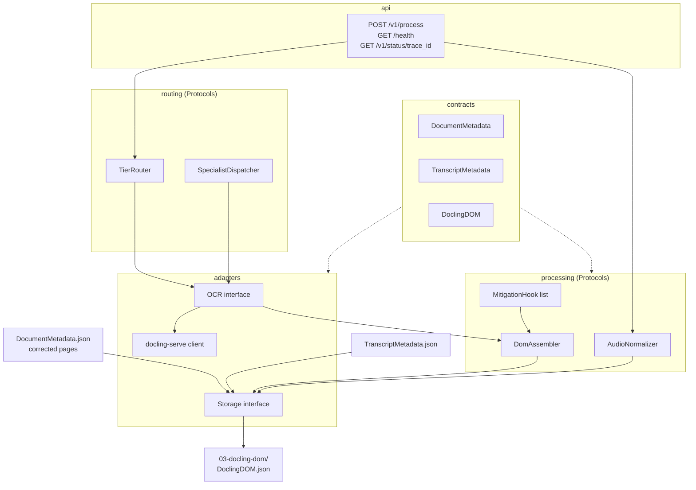

Unify is stage 3 of the [Foundry pipeline](../../pipeline-level-0.md). The design below comes from the approved
[Foundry Unify design spec](https://github.com/williaby/image-preprocessing-detector/blob/main/docs/superpowers/specs/2026-05-05-foundry-unify-design.md).
**Most of it is specified, not built.** The status table at the end separates the two.

## Role

Unify receives one of two inputs and always produces one output shape:

| Direction | Artifact | Source or consumer |
| --- | --- | --- |
| Input, document track | `DocumentMetadata.json` plus corrected page images | Prepare-Doc (`01-preprocessed/`) |
| Input, audio track | `TranscriptMetadata.json` (carries a pre-assembled `docling_document`) | Prepare-Audio (`02-transcribed/`) |
| Output | `DoclingDOM.json` | Chunk (`03-docling-dom/`) |

The document track runs OCR through docling-serve. The audio track skips OCR and normalizes the transcript to the
same DOM, so Chunk never needs to know which track produced it.

## Planned components

The OCR interface is how the document track reaches docling-serve; the spec's concrete adapters are a docling-serve
HTTP client and a Google Cloud Storage adapter. In the spec, `contracts` is the only layer that changes when upstream
schemas change, `adapters` hold all I/O, and `api` delegates immediately. All interfaces are Python `Protocol`
classes injected with FastAPI `Depends()`.

## Request flow

1. `POST /v1/process` receives `trace_id`, `document_id`, `source_track`, and `env`.
2. The storage adapter downloads the metadata file. A missing `source_track` is a hard error
   (`MISSING_SOURCE_TRACK`).
3. Document track: `TierRouter` picks the processing tier, the docling-serve client converts each page using the
   routing parameters from `DocumentMetadata`, and `DomAssembler` builds the DOM with mitigation hooks applied.
4. Audio track: `AudioNormalizer` converts the transcript to a DOM with no OCR. A missing `docling_document` is a hard
   error (`MISSING_DOCLING_DOM`).
5. The storage adapter writes `DoclingDOM.json` to `03-docling-dom/` and the API returns the output path.

## Phase plan

| Phase | Scope |
| --- | --- |
| B1 | Package skeleton with stubs behind every interface, docling-serve client, storage adapter, `POST /v1/process` |
| B2 | Audio normalization, graph-based reading order with confidence, parasitic content (headers, footers) flagging |
| B3 | Specialist OCR engines (tables, formulas, handwriting, code), KI-002 and KI-003 mitigations enabled |
| B4 | VLM tiers (`vlm_assisted`, `vlm_validated`) and VLM validation in the tier router |

B1 is done when the five integration checks in the spec pass (born-digital PDF to DOM, routing parameters applied,
audio passthrough, and the two error codes).

## Build status

Verified against `src/foundry_unify/` in this repository.

| Item | Status |
| --- | --- |
| Security middleware, correlation middleware, structured logging, `core/config.py` (log settings only), exception hierarchy | Built (template infrastructure) |
| Health router (`api/health.py`) | Built but not mounted; there is no application entry point |
| `contracts/` models (`DocumentMetadata`, `TranscriptMetadata`, `DoclingDOM`) | Specified, not built |
| docling-serve client, storage adapter (GCS or otherwise), OCR interface | Specified, not built |
| `TierRouter`, `SpecialistDispatcher`, `DomAssembler`, `AudioNormalizer`, mitigation hooks | Specified, not built |
| `POST /v1/process`, `GET /v1/status/{trace_id}`, app factory | Specified, not built |
| Specialist OCR, VLM tiers, reading order (B2 to B4) | Specified, not built |

The spec calls the package layout `api/routes.py`, `contracts/`, `adapters/`, `routing/`, `processing/`, `app.py`;
none of those modules exist yet. Wire-level contracts are in `docs/development/RAG Pipeline/` in
[image-preprocessing-detector](https://github.com/williaby/image-preprocessing-detector).
